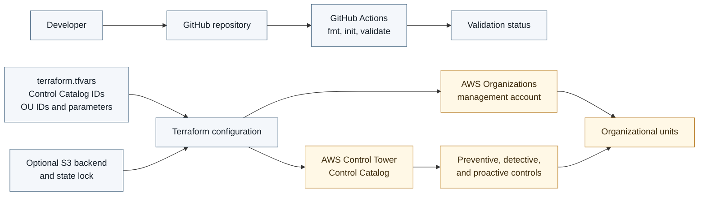

# AWS Control Tower Terraform

[](https://github.com/urosbabic/aws-control-tower-terraform/actions/workflows/terraform.yml)

This repository provides a generic Terraform configuration for managing AWS Control Tower controls as resources in the AWS Organizations management account. It follows the AWS Prescriptive Guidance pattern and uses global AWS Control Catalog identifiers.

The default configuration is empty and partition-aware. No control is enabled until you provide control IDs and OU IDs in a local variable file.

## Architecture

The following diagram is adapted from the AWS sample repository and shows controls applied across accounts in an organizational unit.

[](https://github.com/aws-samples/aws-control-tower-controls-terraform/blob/main/img/ctc-architecture.png)



The repository currently validates the Terraform configuration only. The AWS Organizations and Control Tower path is the intended deployment architecture for an existing Control Tower landing zone.

## Requirements

* AWS Control Tower 3.2 or later
* Terraform 1.5 or later
* AWS provider 5.94.1 or later
* AWS CLI credentials for the Organizations management account
* An S3 backend and locking table configured for the Terraform state

The deployment role needs the Control Tower and Organizations permissions described in [iam/control-tower-deployer-policy.json](iam/control-tower-deployer-policy.json).

## Configure

Copy the example variables file and replace the placeholder values:

```powershell
Copy-Item terraform.tfvars.example terraform.tfvars
```

Use the [AWS Control Tower global identifiers](https://docs.aws.amazon.com/controltower/latest/controlreference/all-global-identifiers.html) and the OU IDs from the management account. Do not commit `terraform.tfvars` or state files.

Configure the S3 backend in [backend.tf](backend.tf) before using a shared state file. The backend block is commented out intentionally so a fresh checkout cannot accidentally use someone else's state.

## Validate and deploy

```powershell
terraform init -upgrade
terraform fmt -check
terraform validate
terraform plan -var-file="terraform.tfvars"
terraform apply -var-file="terraform.tfvars"
```

Review the plan carefully. Control Tower controls apply to every account in the target organizational unit.

To remove controls managed by this configuration:

```powershell
terraform destroy -var-file="terraform.tfvars"
```

## Parameterized controls

Controls that accept parameters belong in `controls_with_params`. The parameter values are encoded as JSON and passed to the AWS Control Tower API. Follow the parameter names and value types documented for each control.

## Reference

* [AWS Prescriptive Guidance pattern](https://docs.aws.amazon.com/prescriptive-guidance/latest/patterns/deploy-and-manage-aws-control-tower-controls-by-using-terraform.html)
* [AWS sample repository](https://github.com/aws-samples/aws-control-tower-controls-terraform)
* [AWS Control Tower controls library](https://docs.aws.amazon.com/controltower/latest/userguide/controls-reference.html)